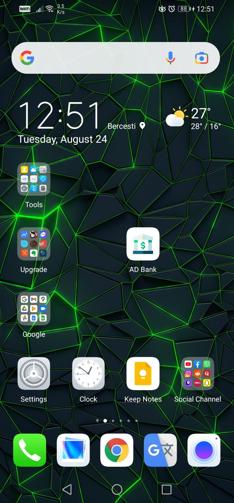

This application  categorizes software files by extension, to illustrate the contents of a software project

## Installation

* Start by downloading a release version from this repository. Click on [Releases]( https://github.com/Cryston98/mobile-application-AdBank/releases "Go to Releases") and download the .apk file
* Install .apk file on your phone

## Application Interface

## Developer

 * Deaconu Sebastian-Adrian
